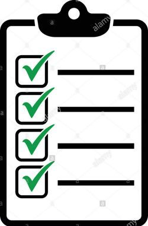

# To-Do-List avec Vue.js
     

    
     
               
Livraison dans le cadre de la formation dev-web, réalisé une ToDo List avec Vue.js.     
     
Critères:     
- [x] Avec Vue JS seulement.      
- [ ] Pas de manipulation native DOM !!!          
:heavy_check_mark: Framework  CSS Materialize.        
:white_check_mark: Librairie Lodash autorisée.
• [ ] Au minimum toutes les options de la précédente ToDo list.     
               
Options de la précédente ToDo list:     
     
• [ ] Ajouter à la liste si clique sur le  bouton.             
- [x] Ajouter à la liste si la touche « Entrée » est appuyer.          
• [ ] Une seule entrée (pas de répétitions sur le même évènement).     
• [ ] Aucune entrée si champ vide.     
• [ ] Format identique pour toutes les entrées (Capitalize : CSS ou JS).          
     
Bonus:     
       
• [ ] Rendre la todo liste la plus prope possible (CSS).     
• [ ] Ajouter une option de suppression d’éléments.     
• [ ] Ajouter une option toggle (item barré si acheté).    
• [ ] Dark mode.     
• [ ] Ajouter un compteur de quantité.     

  

